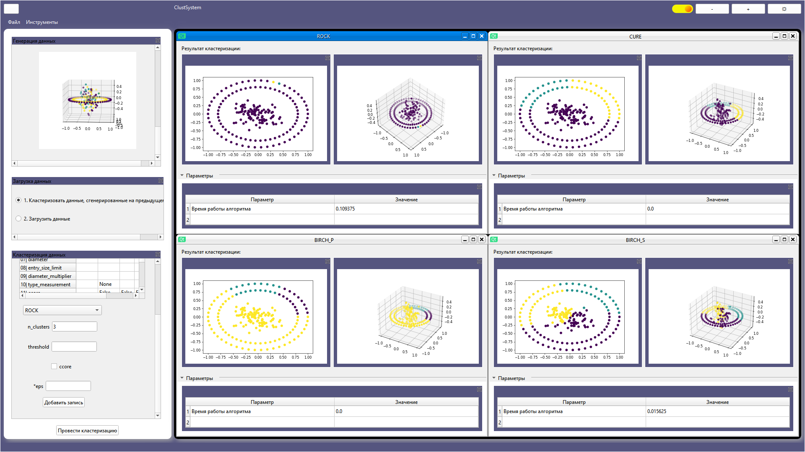

Система кластарезации 
версия: 1.1

Описание: 
	
	Данное ПО написано на языке python и позволяет производить кластарезацию данных на основе распределений, 
	сгенерированных с использованием make-функций и изображений.
	
Установка:
	1. Установите Python 3.11

	2. Разархивируйте код в директорию по умолчанию.

	3. С использованием средств python разверните окружения в корне проекта.

	4. Установите зависимости согласно программной документации.

	6. Запустите сборку в IDE.

Запуск:

	Запуск осуществляется непосредственно в выбранной IDE после предварительной сборки.

Описание директорий:

	1 AnalysisMethods - содержит методы анализа качества кластеризации и их описание.

	2 ClusteringMethods - содержит методы кластеризации и их описание.

	3 DatasetsGenerators - содержит методы для генерации наборов данных.

	4 DatasetsImages - содержит наборы данных для кластеризации.

	5 Examples - содержит результаты откластеризованных наборов данных.

	6 Frameworks_ccore - содержит основные пакеты для работы с настройками.

	7 Frameworks_interface - содержит реализация интерфейса фреймворка.

	8 Programming documentation - содержит программную документацию.

	9 Theoretical documentation - содержит теоретическую документацию.
	
	Дополнительные материалы на основе которых реализован данный фреймворк находятся по ссылке: 		
	https://github.com/MineevS/DMM_DevClustSystem.git

